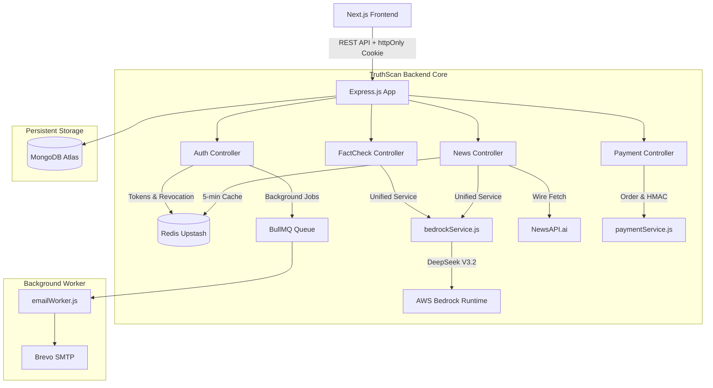

# TruthScan AI — Backend API

An enterprise-grade, modular, and beginner/interview-friendly Node.js & Express REST API for **TruthScan AI**, an AI-powered misinformation analysis platform.

---

## 🏛️ System Architecture

The platform architecture follows a clean, single-pipeline design. Whether claims originate from **News Wire**, **Detect (Text/URL/File)**, or **Camera Scan**, all verification queries normalize into text and route through **one unified AI fact-checking service**.



---

## 🚀 Tech Stack

- **Runtime**: Node.js (ES Modules, JavaScript only)
- **Framework**: Express.js
- **Database**: MongoDB via Mongoose
- **Cache & Key-Value Store**: Upstash Redis via `ioredis`
- **Background Jobs**: BullMQ (isolated worker process)
- **Authentication**: JWT (15-min Access Token in memory + 7-day Refresh Token in httpOnly cookie) & `bcryptjs`
- **AI Engine**: AWS Bedrock Runtime (`@aws-sdk/client-bedrock-runtime`) invoking `deepseek.v3.2`
- **News Aggregator**: NewsAPI.ai / Event Registry
- **Payments**: Razorpay Node.js SDK
- **File Ingestion**: Multer (in-memory buffer parsing)
- **Email Delivery**: Nodemailer + Brevo SMTP

---

## 📁 Folder Structure

```
backend/
├── config/
│   ├── db.js               # MongoDB Mongoose connection
│   ├── redis.js            # ioredis client with auto-TLS support
│   ├── aws.js              # AWS Bedrock runtime client setup
│   └── razorpay.js         # Razorpay SDK initialization
├── controllers/
│   ├── authController.js   # Register, OTP, login, refresh, logout
│   ├── factCheckController.js # AI verification, file checks, user history
│   ├── newsController.js   # News wire ingestion, caching, and fact-checking
│   ├── paymentController.js# Order creation, verification, webhooks
│   └── userController.js   # Profile management
├── middleware/
│   ├── auth.js             # JWT protect & role-based access control (RBAC)
│   ├── errorHandler.js     # Centralized error formatter (400, 401, 404, 409, 429, 500)
│   ├── rateLimiter.js      # Redis atomic rate limiters
│   └── upload.js           # Multer file upload filter (PDF, TXT, PNG, JPG)
├── models/
│   ├── User.js             # User accounts, hashed passwords, verification & roles
│   ├── FactCheck.js        # Historical audit logs, verdicts, confidence & metadata
│   ├── News.js             # News wire article schemas
│   └── Payment.js          # Razorpay orders and payment receipts
├── queues/
│   └── emailQueue.js       # BullMQ queue declaration
├── workers/
│   └── emailWorker.js      # Standalone background worker process for OTP emails
├── routes/
│   ├── authRoutes.js       # /api/auth
│   ├── factCheckRoutes.js  # /api/fact-check
│   ├── newsRoutes.js       # /api/news
│   ├── paymentRoutes.js    # /api/payments
│   └── userRoutes.js       # /api/users
├── services/
│   ├── bedrockService.js   # Unified AI service with DeepSeek V3.2
│   ├── newsService.js      # NewsAPI.ai client with Redis 5-min caching
│   ├── emailService.js     # Brevo SMTP transport
│   └── paymentService.js   # Server-side pricing catalog, orders & HMAC signatures
├── utils/
│   ├── generateOtp.js      # Secure 6-digit random code generator
│   └── tokens.js           # JWT access & refresh token helper
├── app.js                  # Express middleware & route composition
├── server.js               # Server entry point & database initialization
├── package.json
├── .env.example
└── .gitignore
```

---

## ⚙️ Environment Variables

Create `.env` using `.env.example`:

| Variable | Description |
|---|---|
| `PORT` | HTTP port for server (default: `4000`) |
| `NODE_ENV` | `development` or `production` |
| `CLIENT_URL` | Frontend origin for CORS with credentials (`http://localhost:3000`) |
| `MONGO_URI` | MongoDB Atlas connection string |
| `REDIS_URL` | Redis / Upstash Redis connection string |
| `JWT_ACCESS_SECRET` | Secret key for access token signing |
| `JWT_REFRESH_SECRET` | Secret key for refresh token signing |
| `ACCESS_TOKEN_EXPIRES_IN` | Duration of access token (e.g. `15m`) |
| `REFRESH_TOKEN_EXPIRES_IN` | Duration of refresh token (e.g. `7d`) |
| `SMTP_HOST` / `SMTP_PORT` | Brevo SMTP host (`smtp-relay.brevo.com`) and port (`587`) |
| `SMTP_USER` / `SMTP_PASS` | Brevo SMTP credentials |
| `FROM_EMAIL` | Sender email address |
| `AWS_REGION` | AWS region (e.g. `us-east-1` or `ap-south-1`) |
| `AWS_ACCESS_KEY_ID` | AWS IAM access key |
| `AWS_SECRET_ACCESS_KEY` | AWS IAM secret key |
| `BEDROCK_MODEL_ID` | Model identifier (`deepseek.v3.2`) |
| `NEWSAPI_AI_KEY` | NewsAPI.ai / Event Registry API key |
| `RAZORPAY_KEY_ID` | Razorpay Key ID |
| `RAZORPAY_KEY_SECRET` | Razorpay Key Secret |
| `RAZORPAY_WEBHOOK_SECRET` | Razorpay webhook secret |

---

## 📦 Installation & Running

### 1. Install Dependencies
```bash
cd backend
npm install
```

### 2. Start the Express API Server
```bash
npm run dev     # Starts with nodemon live reload
# or
npm start       # Starts with standard node
```
The server will boot on `http://localhost:4000/api`.

### 3. Start the Background Email Worker (in a separate terminal)
```bash
npm run worker
# or
node workers/emailWorker.js
```

---

## 📡 API Endpoints Reference

### Authentication (`/api/auth`)
| Method | Endpoint | Access | Description |
|---|---|---|---|
| `POST` | `/api/auth/register` | Public | Register new investigator account (dispatches OTP) |
| `POST` | `/api/auth/send-otp` | Public | Request or resend 6-digit OTP code |
| `POST` | `/api/auth/verify-otp` | Public | Verify OTP code & activate account |
| `POST` | `/api/auth/login` | Public | Login with email & password (returns JWT & sets cookie) |
| `POST` | `/api/auth/refresh` | Public | Refresh expired access token using httpOnly cookie |
| `POST` | `/api/auth/logout` | Public | Revoke session & clear refresh cookie |

### Fact-Checking (`/api/fact-check`)
| Method | Endpoint | Access | Description |
|---|---|---|---|
| `POST` | `/api/fact-check` | Protected | Submit raw text claim, URL, or OCR scan for AI verdict |
| `POST` | `/api/fact-check/file` | Protected | Upload evidence file (PDF, TXT, PNG, JPG) |
| `GET` | `/api/fact-check/history` | Protected | Retrieve paginated history for authenticated user |
| `GET` | `/api/fact-check/:id` | Protected | Inspect single audit record (ownership-protected) |

### News Wire (`/api/news`)
| Method | Endpoint | Access | Description |
|---|---|---|---|
| `GET` | `/api/news` | Public | Retrieve cached wire articles (5-min Redis TTL) |
| `GET` | `/api/news/refresh` | Public | Explicitly fetch fresh articles and update cache |
| `POST` | `/api/news/fact-check` | Public / Optional Auth | Run AI fact check on an individual news wire card |

### Payments (`/api/payments`)
| Method | Endpoint | Access | Description |
|---|---|---|---|
| `POST` | `/api/payments/create-order`| Protected | Generate Razorpay order ID using server pricing |
| `POST` | `/api/payments/verify` | Protected | Verify HMAC-SHA256 signature and activate Premium |
| `POST` | `/api/payments/webhook` | Public | Receive Razorpay webhook notifications |

### Users (`/api/users`)
| Method | Endpoint | Access | Description |
|---|---|---|---|
| `GET` | `/api/users/profile` | Protected | Get authenticated investigator profile |
| `PUT` | `/api/users/profile` | Protected | Update profile metadata |

---

## 🔄 Core Workflow Deep Dives

### 1. Unified AI Fact-Checking Flow
Regardless of origin:
1. Client submits content to `/api/fact-check` with `type` (`text`, `url`, `file`, `news`, `scan`).
2. Payload passes JWT authentication and Redis rate limiters.
3. Controller delegates directly to `services/bedrockService.js` (`factCheckWithAI`).
4. Service structures prompt enforcing strict rules (no hallucinated evidence, strict `TRUE`/`FALSE`/`MISLEADING`/`UNCERTAIN` enum, 0-100 confidence, and raw JSON output).
5. AWS Bedrock invokes `deepseek.v3.2`.
6. Response is validated against JSON schema and stored in MongoDB under `FactCheck`.
7. Client receives uniform `{ success: true, result: { verdict, confidence, explanation } }`.

### 2. Authentication & Token Lifecycle Flow
- **Registration**: Password is salted and hashed with `bcryptjs`. A 6-digit OTP is generated with `crypto.randomInt`, saved in Redis (`EX 300`), and queued as an async job in BullMQ for Brevo delivery.
- **Verification**: OTP is verified against Redis. Account is marked verified.
- **Tokens**: Short-lived Access Token (15 mins) is passed to frontend state for HTTP `Authorization: Bearer <token>` headers. Long-lived Refresh Token (7 days) is generated with a unique `tokenId` stored in Redis (`refresh:<tokenId> -> userId`) and returned as an `httpOnly` secure cookie.
- **Revocation**: On `/api/auth/logout`, `refresh:<tokenId>` is deleted from Redis, immediately invalidating any subsequent `/api/auth/refresh` attempts.

### 3. News Ingestion & Redis Caching Flow
- `GET /api/news` inspects Redis key `news:latest`.
- If cache hit: returns in <5ms without querying external APIs.
- If cache miss: queries NewsAPI.ai, normalizes the response into standardized fields (`id`, `title`, `description`, `url`, `image`, `source`, `publishedAt`), stores in Redis with `EX 300` (5 minutes), and returns.

---

## 🧪 Postman Testing Checklist

Follow this sequence in Postman or cURL:

1. **Register**: `POST http://localhost:4000/api/auth/register` with `{"name": "...", "email": "...", "password": "..."}`.
2. **Verify OTP**: `POST http://localhost:4000/api/auth/verify-otp` with `{"email": "...", "otp": "..."}`. Save `accessToken`.
3. **Login**: `POST http://localhost:4000/api/auth/login`. Verify `refreshToken` cookie is set in response headers.
4. **Fact Check**: `POST http://localhost:4000/api/fact-check` with `Authorization: Bearer <token>` and `{"text": "...", "type": "text"}`.
5. **Get History**: `GET http://localhost:4000/api/fact-check/history` with `Authorization: Bearer <token>`.
6. **Single Item**: `GET http://localhost:4000/api/fact-check/:id`.
7. **News Wire**: `GET http://localhost:4000/api/news`. Run twice to confirm `"cached": true`.
8. **Create Order**: `POST http://localhost:4000/api/payments/create-order` with `Authorization: Bearer <token>` and `{"planType": "PREMIUM_MONTHLY"}`.
9. **Logout**: `POST http://localhost:4000/api/auth/logout`.
10. **Refresh Check**: `POST http://localhost:4000/api/auth/refresh` (Confirms HTTP 401 rejection).

---

## 🎯 SDE Interview Summary & Talking Points

> **How to explain this system in an interview:**
> 
> *"TruthScan AI is designed around a single-responsibility, unified verification engine. Rather than fragmenting into multiple disparate AI pipelines for news, scans, and text, all multimodal inputs normalize into a standardized text representation before reaching `bedrockService.js`.
> 
> For security, authentication uses dual-token rotation: short-lived 15-minute access tokens in memory and 7-day refresh tokens restricted to httpOnly cookies with server-side revocation in Redis.
> 
> Asynchronous operations like transactional OTP emails are decoupled from HTTP request cycles using BullMQ and Redis, keeping client latency under 50ms while ensuring resilience via automated retries and dead-letter handling.
> 
> High-traffic news reads are protected by a 5-minute Redis caching layer to conserve third-party API quotas, while payment order amounts are strictly calculated server-side with HMAC-SHA256 signature verification to prevent price tampering."*
